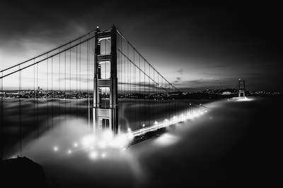
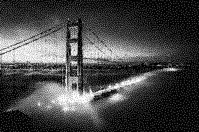

<div align="center">

# Blue Noise

**Dither an image to two colors with blue noise, and generate the tileable noise textures to do it with**

Point it at a photo and get back a stippled version that still reads at small sizes.

<p align="center">
  <a href="https://www.npmjs.com/package/blue-noise">
    
  </a>
  <a href="https://github.com/mblode/blue-noise-typescript/blob/main/LICENSE">
    
  </a>
</p>

</div>

<p align="center">
  
  
</p>

## Install

```bash
npm install -g blue-noise
```

## Quickstart

```bash
# Generate a 64 by 64 tileable texture as ./blue-noise.png, in a few seconds
npx blue-noise generate -s 64

# Dither against it, writing ./photo-dithered.png
npx blue-noise dither photo.jpg -o . -f "#1447e5" -b "#ffffff"
```

Every pixel is compared against the noise value tiled underneath it: brighter than the threshold takes the background color, darker takes the foreground.

## Options

`dither` is the default command, so the input path alone is enough.

| Flag | Default | Description |
|------|---------|-------------|
| `-o, --output <path>` | `output` | Output directory, which must already exist |
| `-n, --noise <path>` | `./blue-noise.png` | Noise texture to threshold against |
| `-f, --foreground <hex>` | `#000000` | Color for pixels darker than the threshold |
| `-b, --background <hex>` | `#ffffff` | Color for pixels brighter than the threshold |
| `-w, --width <number>` | | Resize width in pixels before dithering |
| `-h, --height <number>` | | Resize height in pixels before dithering |
| `-c, --contrast <number>` | `1.0` | Contrast adjustment, above 1 for more |

## Generating textures

```bash
npx blue-noise generate -s 128 --sigma 2.1 --seed 42 -v
```

| Flag | Default | Description |
|------|---------|-------------|
| `-s, --size <number>` | `128` | Square texture size, 8 to 512 |
| `-o, --output <path>` | `./blue-noise.png` | Where to write the PNG |
| `--sigma <number>` | `1.9` | Gaussian sigma, 1.0 to 3.0, higher spreads further |
| `--seed <number>` | | Seed for a reproducible texture |
| `-v, --verbose` | `false` | Print progress through each phase |

## Notes

- 64 by 64 generates in a few seconds; 128 by 128 takes over a minute. Generate once and reuse the file.
- Distances wrap at the edges, so a texture tiles seamlessly across an image of any size.
- Power-of-two sizes run their Gaussian blur through an FFT, roughly halving generation time.
- Uses the void-and-cluster algorithm from [Ulichney (1993)](https://doi.org/10.1117/12.152707), building on [Ulichney (1988)](https://doi.org/10.1109/5.3288).
- [blue-noise-rust](https://github.com/mblode/blue-noise-rust) is the same dithering as a Rust crate, if you want it in a native pipeline.
- Further reading: [Ditherpunk](https://surma.dev/lab/ditherpunk/), [Dithering Part 1](https://visualrambling.space/dithering-part-1/), and [Dither Asteroids](https://blode.co/dither-asteroids).

## License

MIT

---

Crafted by [](https://blode.co) [Matthew Blode](https://blode.co)
